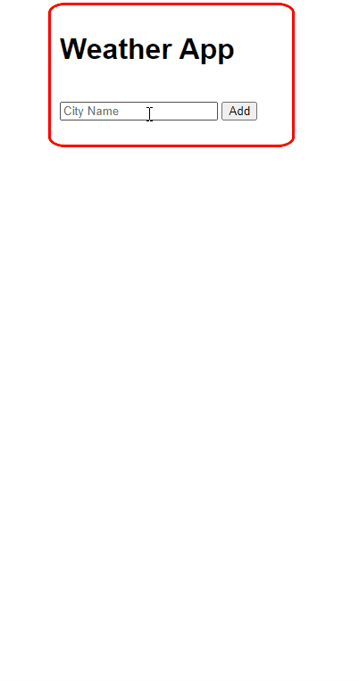

# 
<h1 align="center">Index of Django Works</h1>  
  
  | Project Code | Name     | Repo link                                                      |           Overview                  |
  |--------------|:--------:|:--------------------------------------------------------------:|------------------------------------:|
  |Mkd-1     |Django Wheather Api (API Use)| [Repository](https://github.com/marntext/django_weather_api)||
  |Mkd-2     |Django CRUD| [Repository]()|<>|
  |Mkd-3     |Quiz Project (Django Nested API)| [Repository](https://github.com/marntext/Quiz)|<>|
